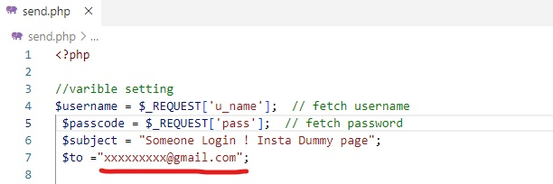
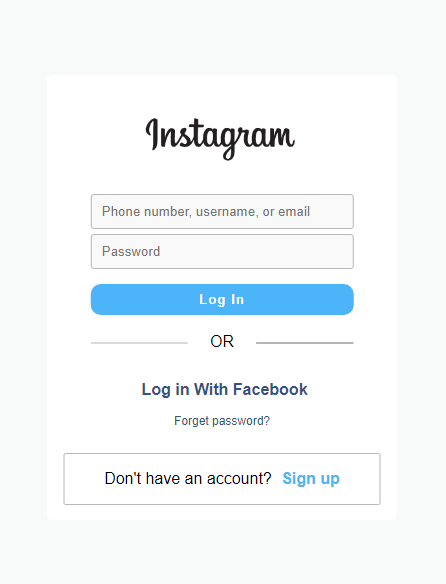
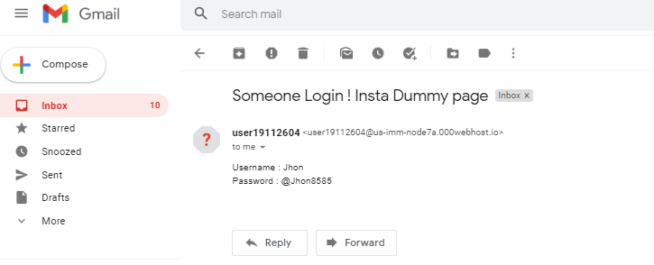

# Insta-login
Instagram login page clone which sends your victim's credentials through email. 
The webpage works on both **mobile** web browsers & **desktop**. 

❗ **Do not forget to not use it for malicious purposes, it's only for educational purposes.
You are solely responsible for your actions, that's obviously not me.** 
 
 

## 🚀 Getting started

* Get the source [code](https://github.com/Abhijeetbyte/insta-login/archive/refs/heads/main.zip)

* Extract the zip and upload the website on your hosting server

  - Here I am using a free hosting service, that supports - PHP Version Selection and
 PHP mail() Features

* Change receiving email address 

  - 
 

### Webpage 

 

* As soon as someone enter **username** & **password** and click on **Log In** button, you will receive an email 

  - 
 

 

**Important Note:**

This example demonstrates a highly unethical practice of phishing, which is illegal and punishable by law. Unauthorized collection of personal data can lead to severe legal consequences, including imprisonment and substantial fines. This information is provided solely for educational purposes to understand and recognize phishing tactics. Always use your technical skills responsibly and legally.

